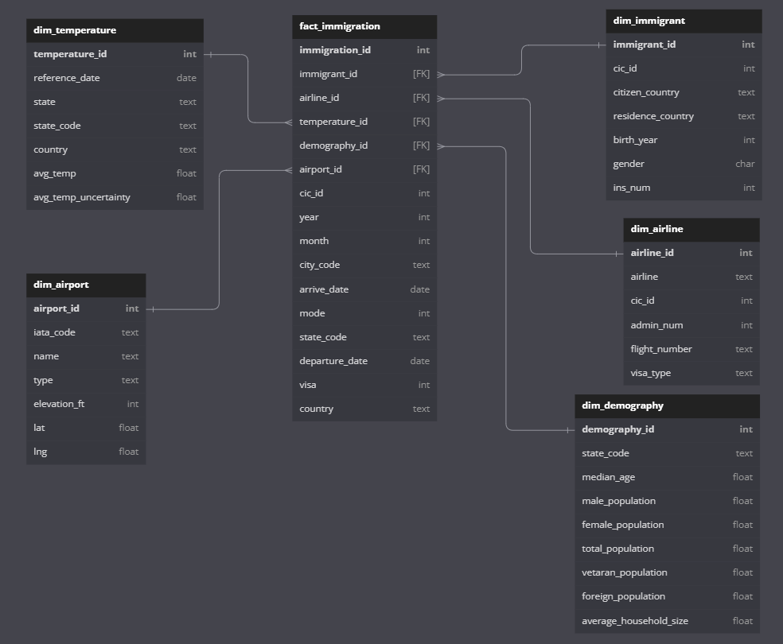

## Data Pipelines with Apache Airflow

### Intro
---
Course: Udacity Nanodegree Data Engineering <br>
Project: Project 6 - Capstone Project <br>
Owner: Mihaly Garamvolgyi <br>
Date: 2023-02-02 <br>

A fictional data warehouse for analytical purposes that contains US immigration data from various sources. The main table is from US National Tourism and Trade Office. Other sources include temperature data, demographic data and airport data.

### Description
---
The scope of this project to integrate I94 immigration data with other data sources including world temperature data, US demographic data and airport codes to create a simple star schema data warehouse for analytical purposes.

An Apache Spark instance is utilised that reads data from all sources, the data is then examined and cleaned and saved to .parquet files to create a simple star schema using Kimball methodology - this dataset is in turn suitable for professionals to analyse and draw conclusions.

The project follows the below steps:
Step 1: Scope the Project and Gather Data
Step 2: Explore and Assess the Data
Step 3: Define the Data Model
Step 4: Run ETL to Model the Data
Step 5: Complete Project Write Up

### Project Structure
---

```
.
├── Capstone Project.ipynb      # notebook containing the implementation
├── sas_data                    # input folder for i94 data
├── airport_codes               # aiport codes for lookup
├── GlobalLandTemperature       # temperature data
├── us-cities-demographics.csv  # demography data
├── output folders              # output data as marked by folder name
└── README.md
```

### Step 1: Scope the Project and Gather Data

Please see implementation notebook for further details.

#### Datasets

1. I94 Immigration data [link](https://www.trade.gov/national-travel-and-tourism-office)
2. World Temperature Data [link](https://www.kaggle.com/datasets/berkeleyearth/climate-change-earth-surface-temperature-data)
3. US City Demographic Data [link](https://public.opendatasoft.com/explore/dataset/us-cities-demographics/export/)
4. Airport Codes table [link](https://datahub.io/core/airport-codes#data)
5. Reference tables for abbreviations of country, city and state and lookup tables for abbreviations

#### Tools
Apache-spark is used for implementation for its capability to analyse and digest massive ammounts of data

### Step 2: Explore and Assess the data

Please see implementation notebook for further details.

#### Explore the data

1. Using Spark to explore the data and get an overview of necessary cleaning steps
2. Get an idea of Fact and Dim table contents

#### Cleanigng the data

1. Transform necessary columns to dates
2. Clean data and merge with lookup tables
3. Drop invalid rows


### Step 3: Define the Data Model

The selected data model for business analysis is the star schema. Star schema is the most suitable analytical data model for analysing a single business process - in this case the immigration to the US. This methodology is developed as per Kimball.

What is the business process? What is the smallest granularity? What are the factors that impact upon the business process itself?

A single Fact table is created with the immigration event as granularity.

Multiple Dimension tables are created that allow business analysts and professionals to analyse the process of immigration. Dimension tables are for filtering and slicing and dicing of events.

```
├── FACT
│   └── immigration
└── DIMENSIONS
    ├── immigrant
    ├── airline
    ├── demography
    ├── temperature
    └── airport

```
The final schema of the output data:




### Step 4: Run ETL to Model the Data

The steps for the data pipeline is mapped as follows:

* Load the data into Spark staging tables
* Clean data using Spark
* Create Dimension tables using Spark SQL and create unique IDs for Dimension tables
* Create Fact table with uniqe IDs and map Dimension table IDs as foreign keys.
* Write data into parquet files
* Perform data quality checks

Please run the ETL process using the notebook file.

For the data dictionary please refer to the notebook file.

### Step 5: Complete Project Write Up

#### 5.1 Rationale for choice of tools
Clearly state the rationale for the choice of tools and technologies for the project.
The project uses Apache Spark engine. Spark is an simple and fast and also scalable analytics engine for large scale data processing.  It has an ability to process and analyse massive ammounts of data using PySpark interface.


#### 5.2 Data updates
Propose how often the data should be updated and why.
The fact table is created on a monthly basis - as such the data set could be updated on a monthly basis. 

#### 5.3 Scenario analysis
* Write a description of how you would approach the problem differently under the following scenarios:
 * The data was increased by 100x.
 * The data populates a dashboard that must be updated on a daily basis by 7am every day.
 * The database needed to be accessed by 100+ people.

#### 5.3.1 Data volume increase
Current implementation is not suitable for handling such a large volumen increase. Should the volume increase, more sophisticated data framework should be implemented. S3 data storage should be used. An Amazon EMR cluster could be utilized  behind Apache Spark. Amazon Redshift distributed datase should be utilized.

#### 5.3.2 Data update frequency increase
Current ETL process is implemented in Jupyter Notebook. This is not suitable for an automated data pipeline. In such a case the ETL pipeline should be implemented in Apache Airflow using predefined DAGs. Quality checks and timing could be implemented using Airflow.

#### 5.3.3 Data user increase
Currently no database is created behind the solution as this is designed for analytical purposes for a small scale of users. Should the number of users increase, a distributed database solution should be implemented like Amazon Redshift - this database could handle massive data for a large number of users even if located in different parts of the world.


### Dependencies
---
- Python 3
- apache-spark

### How to run
---
Run the cells in the attached project notebook. 